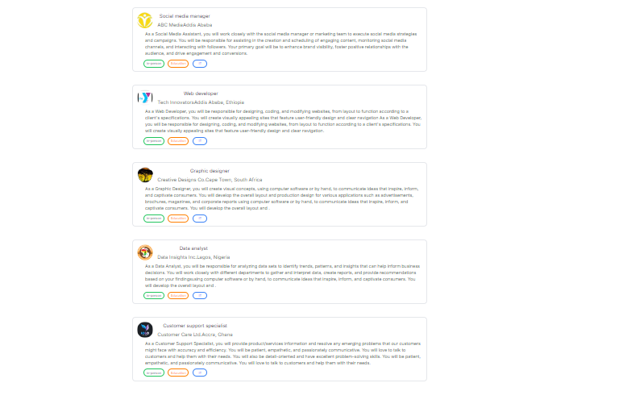
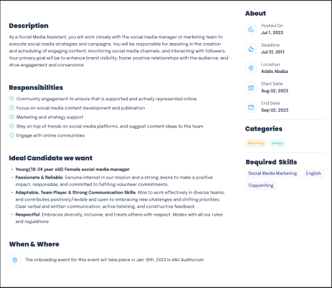

# Task 6

# Create a React component for a card resembling the one provided in the figma design. Additionally, you need to populate this card with dummy data and include an avatar image. You also need to create the Job Listing Dashboard.

# The card should have the following features:

# 1. The card should have an avatar image, title, description, and a button.    
# 2. The card should have a hover effect.
# 3. The card should have a shadow effect.

# The Job Listing Dashboard should have the following features:
#should have a job decrption, location, and a button.

# The design for the card and the Job Listing Dashboard is provided in the figma link below:
https://www.figma.com/file/igmFo7dypzpuM02KJi8cay/Task-1?type=design&node-id=0%3A1&mode=design&t=FUZyVfl0w887g31l-1

# one component for the card and one for the job listing dashboard.

# the whole card component 

#the description of the card component

# to run this code you need to install the following dependencies
# npm install react-icons
# 

